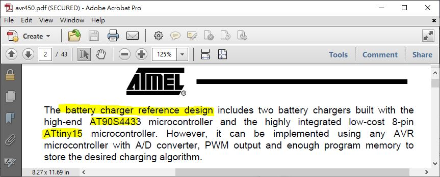
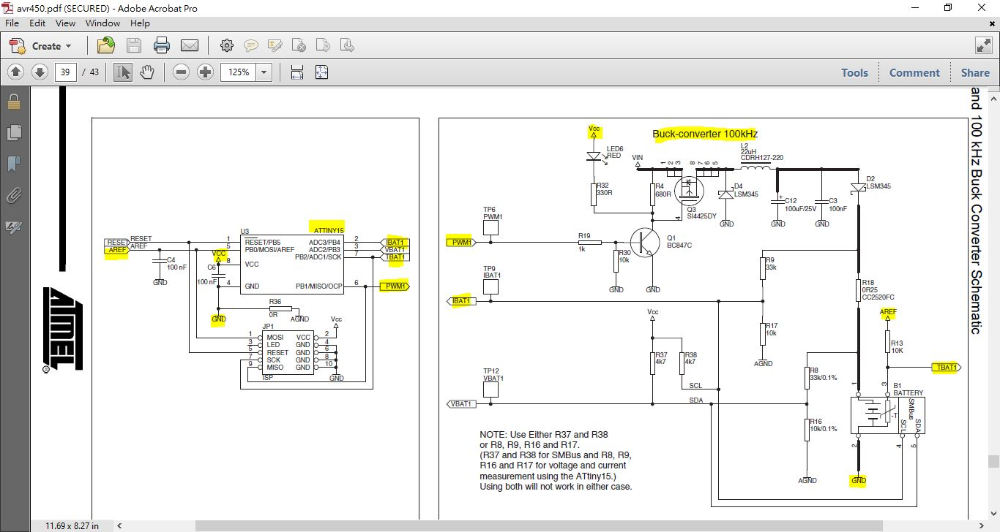

# avr450

## assembler used is [AVRA (open source)](https://github.com/Ro5bert/avra),
the equilvent of AVRASM2 (Atmel's software product). AVRA need device header files (*.inc) to work with. 
how to obtians those header files? download and install [AVR studio 7.0](https://www.microchip.com/mplab/avr-support/atmel-studio-7), header files was there,  
```
C:\Program Files (x86)\Atmel\Studio\7.0\packs\atmel\ATtiny_DFP\1.3.229\avrasm  
```

copy this folder \avrasm\ to project root, 
edit Makefile, include the flagm "ASFLAGS= -I ../avrasm/inc"

or uses AVRA header files, location,
```
/usr/share/avra
```
edit Makefile accorrdingly, include the flagm "ASFLAGS= -I /usr/share/avra"


## how to assemble the asm files.
Ubuntu 20.04, install AVRA first and then 'make all' 
```
sudo apt update
sudo apt upgrade
sudo apt-get install avrdude avra
cd $HOME
git clone https://github.com/xiaolaba/avr450
cd $HOME/avr450/avr450_source_code/tiny15_asm
make clean
make all

```  


after local change/update code design, how to push to github for storage,  
```
# after changed source code, tell git to add those changes,  
git add *

# commit the change, tell what is about, github will and display,
git commit -m "descritopn of this change/update"

# this is real action, updated file/code will push to github,
git push
```


## AVR450 
Atmel / microchip pulled off this application note and source code, and no longer available for download, but why.  

this is collection from the internet, however do not remember where pulled.  

it is a reference design for li-polymer battery charging with code/hardware design.  

  

  

[SI4425, P-MOS](SI4425_P-MOS.pdf)  

[LSM345_Schottky_diode](LSM345_MicrosemiCorporation.pdf)
